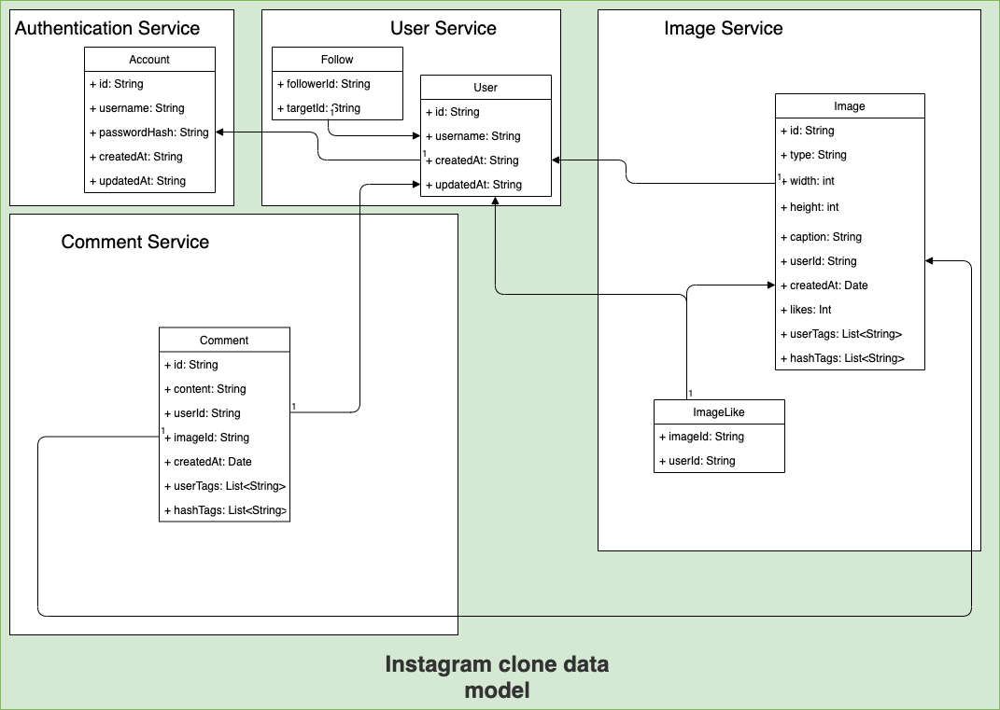

# instagram-clone

Group project for Distributed Systems course at the University of Oulu.

## Group members

| Name                            | Student ID      | GitHub                                          |
|---------------------------------|-----------------|-------------------------------------------------|
| Perttu Kärnä                    | 2465119         | [ppeerttu](https://github.com/ppeerttu)         |
| Guanchen LI                     | 2627656         | [Ivan-Lee99](https://github.com/Ivan-Lee99)     |
| Juho Kantola                    | 2519793         | [knatola](https://github.com/knatola)           |
| Xin Shu                         | 2627520         | [Mr-Sushi](https://github.com/Mr-Sushi)         |

## Project description

This project is course work implementation for Distributed Systems course at the University of Oulu. The group members (and collaborators) are mentioned in [group members](#group-members) section.

This system is a naive clone of [Instagram](https://www.instagram.com/), containing mainly the backend functionality. We're not considering the client implementation in this project. The functionality that the system covers is as follows:

1. Create and manage account
2. Authentication and access control
3. Follow users
4. Post, read and delete images
5. Comment on images
6. Like images

The aim of the project is mainly within the field of distributed systems: to make scalable, fault tolerant, loosely coupled and highly available distributed system.

## System design

The system consists of isolated loosely coupled components called **services**. The workload of the system has been divided to the services based on logical functionality areas of the system: images, comments, users etc. The communication between the services happens with [gRPC][grpc-site], and service discovery happens via [Consul][consul-site], which can be considered as one of component as well. The system exposes one public HTTP REST API for clients - all gRPC APIs and communication is supposed to be private.

See the system architecture below.

### Authentication service

The [authentication service](auth-service/) is responsible for account and authentication management. It stores account credentials, and uses [JSON Web Tokens][jwt-site] for authorization. While all services could utilize auth service for fine grained access control, for the sake of simplicity in our implementation the requests are validated only by the REST API.

### User servcice

The user service is responsible for managing user information related to the user profile, such as biography and followers. In our implementation it is kept really simple. Accounts from auth service are directly mapped one-to-one with users in user service, even though in real life these could be kept separate (one account holds access to multiple users/profiles).

### Image service

The [image service](image-service/) is responsible for managing posted images. It stores image metadata, likes and the actual image data. While in real life implementations the actual image files might be kept in external CDN servers, in our implementation the images are stored directly on the file system of the image service container. Shared volumes between containers enables scaling.

### Comment service

The [comment service](comment-service/) is simply responsible for managing comments of images.

### REST API

The [REST API](rest-api/) component is exposing public HTTP REST APIs to be consumed by the clients. Thus, the REST API component consumes all the other gRPC services.

### Service discovery

The [service discovery](service-discovery/) component is simply [Consul][consul-site], which enables service registration and discovery via HTTP endpoints.

### Data model and databases

Each service has their own isolated database. The databases has been selected as follows:

* [MongoDB][mongo-site]
  *  Image service
  *  Comment service
* [PostgreSQL][psql-site]
  * Auth service
  * User service

The data of the system is being stored in following structure.

[grpc-site]:https://grpc.io/
[consul-site]:https://www.consul.io/
[jwt-site]:https://jwt.io/
[mongo-site]:https://www.mongodb.com/
[psql-site]:https://www.postgresql.org/
