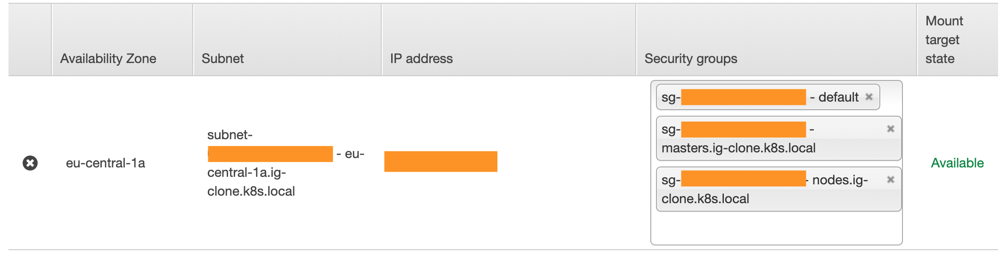

# Instagram clone with Kubernetes

These are instructions on how to run the Instagram clone with Kubernetes.

## Requirements

* Some Kubernetes cluster setup
  * [Minikube][minikube-site] is good for local development
  * [kops][kops-site] for cloud providers (AWS & GKE)
* [kubectl][kubectl-site] installed
* [Helm][helm-site] installed

## Getting started

Here is the documentation for deploying the instagram-clone project into Kubernetes. Please note that this is just **one** way to do it, and it's not for production usage.

**NOTE**: This document assumes Helm version 3; in case you're using Helm version 2, you'll have to specify the release name with `--name` flag. See the examples below:
```bash
# Helm 2
helm install --name kafka bitnami/kafka

# Helm 3
helm instal kafka bitnami/kafka
```

### Useful commands

#### port-forward

For example, after deploying `auth-service`, forward network traffic from host port 3001 to `auth-service` port 3000 by running ` service/auth-service 3001:3000`. This enables testing the gRPC API e.g. by using BloomRPC.

### Prepare cluster and Helm

1. Start up the cluster
    * E.g. `minikube start`
2. (Helm 2): Setup cluster role for tiller
    * `kubectl --namespace kube-system create serviceaccount tiller`
    * `kubectl create clusterrolebinding tiller --clusterrole cluster-admin --serviceaccount=kube-system:tiller`
3. (Helm 2): Install `tiller` server into your cluster: `helm init`
    * In case you run into an error, you can try to install it from [tiller.yaml](tiller.yaml) file: `kubectl apply -f tiller.yaml` (see related [issue][helm-issue])
4. Check that helm is running: `helm version`
    * With Helm version 3 you'll see only client; Helm 2 will show also (Tiller) server version
    * (Helm 2): You can also check that tiller is running by issuing `kubectl get pods --namespace kube-system`
5. Add following Helm repos
    * `helm repo add stable https://kubernetes-charts.storage.googleapis.com/`
    * `helm repo add bitnami https://charts.bitnami.com/bitnami`
6. Deploy the [dashboard][dashboard-site] (optional)
    * `kubectl apply -f https://raw.githubusercontent.com/kubernetes/dashboard/v2.0.0-beta8/aio/deploy/recommended.yaml`
    * `kubectl apply -f account/service-account.yaml` will deploy an account to access the dashboard
    * `sh scripts/token.sh` will create an access token to access the dashboard
    * `kubectl proxy` will create a tunnel to access the dashboard
    * The dashboard is available at http://localhost:8001/api/v1/namespaces/kubernetes-dashboard/services/https:kubernetes-dashboard:/proxy/ or at http://localhost:8001/ui
    * Use the access token to access the dashboard

### Metrics server

In order to be able to use autoscaling for pods in Kubernetes, you'll need to install [metrics-server][metrics-server-site] to the cluster. This can be done in various ways, and usually it's cluster provider dependent; Minikube has slightly different deployment process than AWS.

For Minikube, this should do the trick:

```bash
minikube addons enable metrics-server  
```

However, [AWS](https://docs.aws.amazon.com/eks/latest/userguide/metrics-server.html) is a bit more tricky:

```bash
# Install directly from script; will download sources locally
sh scripts/metrics-server.sh
```

After deploying the `metrics-server`, you can try to list node metrics e.g. by `kubectl top nodes` or `kubectl top pods`. In case the metrics server doesn't seem to be able to get metrics from nodes and pods, you might have a [well-known issue](https://github.com/kubernetes-sigs/metrics-server/issues/212#issuecomment-459321884). Steps to take:

```bash
# Remember to export KOPS_STATE_STORE
# You might also have different cluster name
kops edit cluster ig-clone.k8s.local
```

And edit Cluster resource to:

```yml
kubelet:
  anonymousAuth: false
  authenticationTokenWebhook: true
  authorizationMode: Webhook
```

Then run these commands:

```bash
# Print out changes that would be applied (note that they're not applied yet, even though you modified cluster config)
kops update cluster ig-clone.k8s.local

# Actually update config
kops update cluster ig-clone.k8s.local --yes

# List all nodes that needs to be restarted in order to use the new config
kops rolling-update cluster ig-clone.k8s.local

# Actually roll out the update by restarting nodes
kops rolling-update cluster ig-clone.k8s.local --yes
```

Please note that updating the cluster might take a while.

**NOTE**: You may end up reaching resource limits in case you use default cluster size (master m3.medium + 2 nodes t2.medium). You can increase the node count in similar configuration change, just edit nodes: `kops edit ig nodes` and increase the `maxSize` for nodes.


### Deploy Kafka

We use Helm to install Kafka into our cluster. Please note that `-f kafka-values.yaml` will use [kafka-values.yaml](kafka-values.yaml) to override some default configuration properties.

```bash
# Helm 2
helm install bitnami/kafka --name kafka -f kafka-values.yaml
# Helm 3
helm install kafka bitnami/kafka -f kafka-values.yaml
```

### Deploy auth-service

The first step is to install the PostgreSQL Helm chart. There is a [custom values file](auth-service/postgres-values.yaml) that can be used to setup username, password and persistent volume claim size.

```bash
helm install auth-db stable/postgresql -f auth-service/postgres-values.yaml
```

The next step is to install the Redis with certain overridden parameters.

```bash
helm install redis bitnami/redis -f auth-service/redis-values.yaml
```

And lastly, deploy the actual application.

```bash
kubectl apply -f auth-service/deployment.yaml
```

### Deploy rest-api

The `rest-api` is rather simple to deploy.

```bash
# Deploy rest-api-service
kubectl apply -f rest-api-service/service.yaml

# Deploy rest-api containers
kubectl apply -f rest-api-service/deployment.yaml
```

Please note that the deployed service file for `rest-api` creates a service called `rest-api-public` that is of type `LoadBalancer`. When using AWS (EKS), this creates required resources to ELB to create a public endpoint to the cluster. You can get the public address of the load balancer by issuing `kubectl get services` and referring to `EXTERNAL-IP` column. It should be working in a few minutes.

### Deploy image-service

The `image-service` requires MongoDB to be set up. In this cluster, we're going to use single MongoDB cluster for both `image-service` and `comment-service`.

```bash
# Deploy MongoDB
helm install mongodb stable/mongodb -f mongo-values.yaml
```

The `image-service` requires a `PersistentVolumeClaim` with access mode `ReadWriteMany`. AWS doesn't provide that by default, hence we install `aws-efs-csi-driver` to the cluster. It also requires that you create a file system in AWS EFS, and create `image-service/volume.yaml` out of [volume.example.yaml](./image-service/volume.example.yaml) file accordingly (fill in proper `fs-12312312` value). Please also note that the created filesystem should be in the same subnet and share security groups with the cluster network. See the image below for reference.




In case you're running the cluster in somewhere else, see [this](https://kubernetes.io/docs/concepts/storage/persistent-volumes/#access-modes) for more information about supported access modes. Minikube allows local `PersistentVolume`s with `ReadWriteMany` access mode. Below is an example on how to specify a volume e.g. for Minikube. Use this to create the `image-service/volume.yaml` file instead of the [example](image-service/volume.example.yaml) file.

```yaml
apiVersion: v1
kind: PersistentVolume
metadata:
  name: image-data-pv
  labels:
    type: local
spec:
  capacity:
    storage: 1Gi
  accessModes:
    - ReadWriteMany
  hostPath:
    path: /tmp/data/pv-1
```

Now to the actual steps to deploy the `image-service`:

```bash

# Required for ReadWriteMany volume access with AWS EFS (AWS use case only)
kubectl apply -k "github.com/kubernetes-sigs/aws-efs-csi-driver/deploy/kubernetes/overlays/stable/?ref=master"

# Deploy volume for image service data
kubectl apply -f image-service/volume.yaml

# Deploy image-service
kubectl apply -f image-service/deployment.yaml
```

### Deploy comment-service

The `comment-service` requires MongoDB as well. For the sake of simplicity, we are going to use the already deployed MongoDB cluster for `comment-service` as well. Hence, we also use same username-password-database combination as we did with `image-service`.

```bash
# Deploy the comment service
kubectl apply -f comment-service/deployment.yaml
```

### Deploy user-service

The `user-service` relies on PostgreSQL as well, se we are gonna deploy that first.

```bash
# Install separate PostgreSQL for user-service
helm install user-db stable/postgresql -f user-service/postgres-values.yaml
```

Then we are going to install the actual application pod. Please note that the application doesn't manage database migrations, so we have to use initialization pod to migrate the schema to database. This is all described in the [deployment.yaml](./user-service/deployment.yaml) -file.

```bash
# Install user-service
kubectl apply -f user-service/deployment.yaml
```

### Apply auto-scaling

In order to make our services scale on demand, we have to use [Horizontal Pod Autoscaler](https://kubernetes.io/docs/tasks/run-application/horizontal-pod-autoscale-walkthrough/). Here is how you can do it:

```bash
# By default each service has only single replica; this will increase minimum count to 2 and maximum to 5
kubectl autoscale deployment rest-api-service --cpu-percent=50 --min=2 --max=5

```

Please note that this has to be repeated for each deployment. You can get the deployment names with `kubectl get deployments`.

## Final words

With these instructions you should be able to get up and running the instagram clone system in Kubernetes. These configurations are by no means suitable for production usage. We don't use proper namespaces, service accounts and secrets in this setup, as well as some of the provided services (e.g. Kafka, PostgreSQL or MongoDB) are not deployed properly for production usage. Nevertheless, this installation gives some preview on what needs to be done in order to be able to deploy this system for high availability cluster with decent fault tolerance.


[minikube-site]:https://kubernetes.io/docs/setup/learning-environment/minikube/
[kubectl-site]:https://kubernetes.io/docs/tasks/tools/install-kubectl/
[helm-site]:https://helm.sh/
[helm-issue]:https://github.com/helm/helm/issues/6374
[dashboard-site]:https://kubernetes.io/docs/tasks/access-application-cluster/web-ui-dashboard/
[consul-k8s]:https://www.consul.io/docs/platform/k8s/run.html
[kops-site]:https://github.com/kubernetes/kops
[metrics-server-site]:https://github.com/kubernetes-sigs/metrics-server
