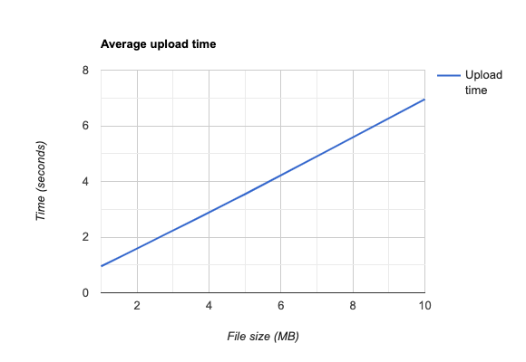

# perf-scripts

According to the course work description, the system "performance" has to be evaulated by answering ceratin set of questions. As the original set of questions was not fully suitable for this system, we adjusted them to match more the requirements of this system. The scripts in this directory are meant to be used to answer the following questions:

* _What is the average time for sending 50 messages between
two nodes (random payload)?_
* _Choose 3 different fixed message sizes (payloads for min,
average, max), what is the average time when sending 25 in
each case?_
* _Test the system performance by stressing it with external HTTP requests_

Each of the cases are briefly described below.

## Average time, 50 requests, random payload

TODO

## Three different fixed sized messages, average request time

The testing of three different fixed size messages is done in this case by uploading three images of different sizes. The feature used in this test is representing the same as posting an image to Instagram.

The images that are posted in this test are:

* [Small image](img/south_america_small.jpg) (~1MB)
* [Medium image](img/south_america_original.jpg) (~5MB)
* [Large image](img/south_america_large.jpg) (~10MB)

Within the test, we upload each image **25** times and calculate the average request time. You can run the tests by:

```bash
# OPTIONAL: Create and activate virtual env
python -m virtualenv env
source env/bin/activate

# Install required dependencies
pip install -r requirements.txt

# Run the test
python images-perf-test.py
```

Please note that for each test, the script creates and eventually deletes a **new** user account. This forces the system to delete all related data such as images and comments from all services (we have limited resources on the cluster).

### Test report

This is a report from a test that was ran on Friday 13th of March, 2020 at 9:30AM - 10:30AM.

#### Circumstances

The system under the test was deployed to Kubernetes cluster running in AWS, region `eu-central-1` (Frankfurt) and the cluster contained three (3) EC2 instances; one (1) `m3.medium` master node, and two (2) `t2.medium` worker nodes. The location of the tester was Oulu, Finland.

The cluster was set up according to [deployment instructions](../deployments/README.md), and thus every service had the following HPA config.

| Service | Min pods | Max pods | CPU percent |
|---------|----------|----------|-------------|
| auth-service | 2 | 5 | 50 |
| comment-service | 2 | 5 | 50 |
| image-service | 2 | 5 | 50 |
| rest-api | 2 | 5 | 50 |
| user-service | 2 | 5 | 50 |

Before running the test, each service was deployed at their minimum pod count (2).

#### The test

The test run took roughly 5 minutes. The log output was as follows:

```
2020-03-13 09:44:18,079 59055 INFO lib.account_session - Created account test-user-1 with id 2457edaf-686c-47c9-a796-9568672d628d
2020-03-13 09:44:19,857 59055 INFO main - Testing with file ./img/south_america_small.jpg, mime type image/jpeg and iterations 25
2020-03-13 09:44:43,659 59055 INFO main - Average request time is 0.951 seconds
2020-03-13 09:44:43,660 59055 INFO main - Testing with file ./img/south_america_original.jpg, mime type image/jpeg and iterations 25
2020-03-13 09:46:12,297 59055 INFO main - Average request time is 3.545 seconds
2020-03-13 09:46:12,297 59055 INFO main - Testing with file ./img/south_america_large.jpg, mime type image/jpeg and iterations 25
2020-03-13 09:49:06,242 59055 INFO main - Average request time is 6.957 seconds
2020-03-13 09:49:06,688 59055 INFO lib.account_session - Deleted account test-user-1 with id 2457edaf-686c-47c9-a796-9568672d628d
```

During the test, the system state was observed through Kubernetes dashboard. During the tests, the pod count of `image-service` was increased by the HPA to the maximum number of five (5). Interestingly, other services didn't scale up.

The results show that the image size does indeed affect to the upload time.

| Image size | Avg. upload time (seconds) |
|------------|----------------------------|
| ~1MB | 0.951 |
| ~5MB | 3.545 |
| ~10MB | 6.957 |

Linear graph courtesy of [RapidTables](https://www.rapidtables.com/tools/line-graph.html).



A few minutes after the test the cluster started to drop down the count of `image-service` pods. The minimum count of two (2) pods was reached around 10:10AM, roughly 10 minutes after the test.

#### Conclusions

As the results show, the growth of upload image size appears to have linear impact to the upload time. The implementation of the image upload involves first uploading the image to Node.js server (`rest-api`), and then forwarding it to Java server (`image-service`) using gRPC streaming request. It has been noted during the system development that the chunk size of gRPC streaming has significant impact to the request time, and no advanced research was done in that area. Thus, it might be possible to increase the upload performance by finding optimal chunk size for the images, but that would also require investigation on what is the average size of an image uploaded to Instagram.

## System stress test

TODO
